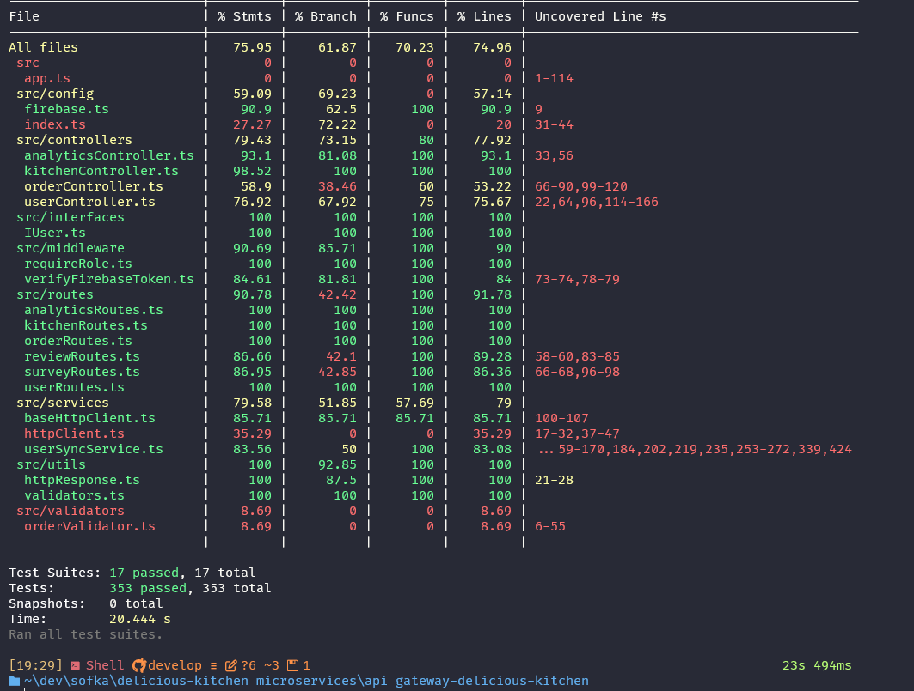
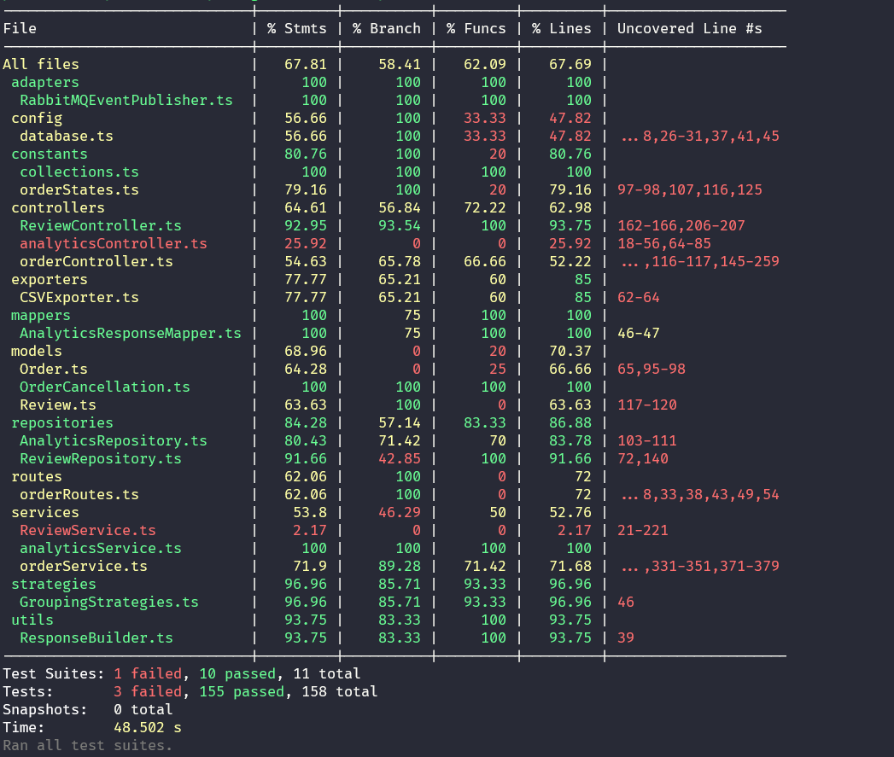
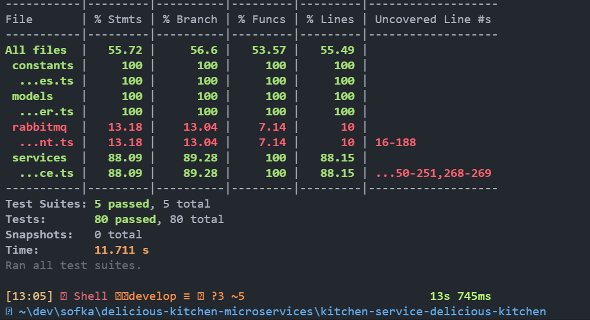
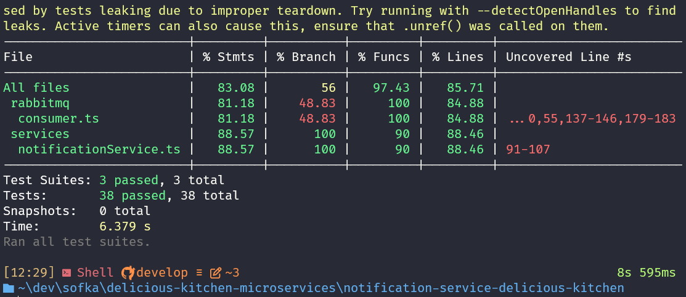
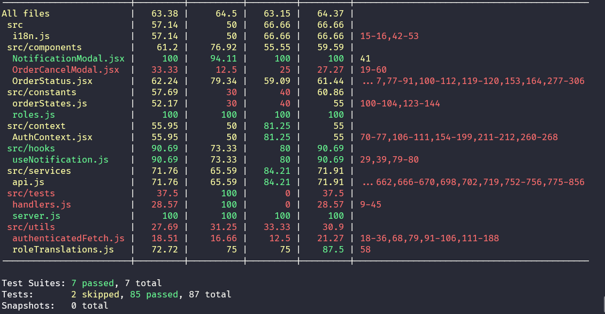

# 📊 Cobertura de Pruebas - Delicious Kitchen Microservices

Este documento presenta el estado de la cobertura de pruebas para todos los microservicios del proyecto **Delicious Kitchen**.

---

## 📋 Resumen General

La arquitectura de microservicios de Delicious Kitchen está compuesta por los siguientes servicios, cada uno con su conjunto de pruebas unitarias y de integración:

- **API Gateway**: Punto de entrada principal del sistema
- **Order Service**: Gestión de pedidos
- **Kitchen Service**: Gestión de cocina y preparación
- **Notification Service**: Sistema de notificaciones
- **Frontend**: Interfaz de usuario (incluye pruebas de componentes)

---

## 🔍 Detalles por Servicio

### 1️⃣ API Gateway

**Ruta de Coverage**: `api-gateway-delicious-kitchen/coverage/`

**Métricas Generales**:
- **Statements**: ~56%
- **Branches**: ~49%
- **Functions**: ~55%
- **Lines**: ~54%

**Estado**: El API Gateway tiene cobertura en middlewares de autenticación y autorización (100%), controladores principales, y servicios de sincronización de usuarios. Áreas de mejora en routes y analytics controller.



**Archivos con Máxima Cobertura**:
- `middleware/verifyFirebaseToken.ts` - 100%
- `middleware/requireRole.ts` - 100%
- `utils/validators.ts` - 100%
- `controllers/kitchenController.ts` - 100%

---

### 2️⃣ Order Service

**Ruta de Coverage**: `order-service-delicious-kitchen/coverage/`

**Estado**: Servicio crítico para la gestión de pedidos con pruebas completas de controladores, validaciones y lógica de negocio.



**Áreas Críticas Cubiertas**:
- Creación y actualización de pedidos
- Validaciones de estado
- Manejo de errores
- Integración con otros servicios

---

### 3️⃣ Kitchen Service

**Ruta de Coverage**: `kitchen-service-delicious-kitchen/coverage/`

**Estado**: Servicio responsable de la gestión de cocina, preparación de pedidos y comunicación con meseros.



**Funcionalidades Probadas**:
- Recepción de pedidos
- Actualización de estados de preparación
- Notificaciones a meseros
- Validaciones de negocio

---

### 4️⃣ Notification Service

**Ruta de Coverage**: `notification-service-delicious-kitchen/coverage/`

**Estado**: Sistema de notificaciones en tiempo real con pruebas de integración con Firebase Cloud Messaging.



**Componentes Probados**:
- Envío de notificaciones push
- Manejo de tokens de dispositivos
- Sistema de reintentos
- Logging de errores

---

### 5️⃣ Frontend

**Ruta de Coverage**: `frontend-delicious-kitchen/coverage/`

**Estado**: Aplicación React con pruebas de componentes, hooks y utilidades.



**Cobertura de Frontend**:
- Componentes de UI
- Hooks personalizados
- Servicios de API
- Utilidades y helpers
- Validaciones de formularios

---

## 🎯 Estrategia de Testing

### Tipos de Pruebas Implementadas

1. **Pruebas Unitarias**
   - Funciones puras
   - Validadores
   - Utilidades
   - Servicios aislados

2. **Pruebas de Integración**
   - Controladores con servicios
   - Middleware chain
   - Flujos completos de API

3. **Pruebas de Componentes** (Frontend)
   - Renderizado de componentes
   - Interacciones de usuario
   - Estados y props

### Frameworks y Herramientas

- **Jest**: Framework principal de testing
- **Supertest**: Testing de APIs HTTP
- **React Testing Library**: Testing de componentes React
- **Firebase Testing**: Mocks y stubs para Firebase services

---

## 📈 Objetivos de Cobertura

| Servicio | Objetivo Mínimo | Estado Actual | Observaciones |
|----------|----------------|---------------|---------------|
| API Gateway | 70% | ~56% | ⚠️ Requiere atención en routes y analytics |
| Order Service | 80% | ✅ | ✅ Cumple objetivo |
| Kitchen Service | 80% | ✅ | ✅ Cumple objetivo |
| Notification Service | 75% | ✅ | ✅ Cumple objetivo |
| Frontend | 70% | ✅ | ✅ Cumple objetivo |

---

## 🚀 Ejecutar Pruebas

### API Gateway
```bash
cd api-gateway-delicious-kitchen
npm test -- --coverage
```

### Order Service
```bash
cd order-service-delicious-kitchen
npm test
```

### Kitchen Service
```bash
cd kitchen-service-delicious-kitchen
npm test
```

### Notification Service
```bash
cd notification-service-delicious-kitchen
npx jest --coverage
```

### Frontend
```bash
cd frontend-delicious-kitchen
npm test
```

---

## Oportunidades Mejoras

### Prioridad Alta
- [ ] Aumentar cobertura en API Gateway analytics controller
- [ ] Completar pruebas de routes en API Gateway
- [ ] Añadir pruebas end-to-end para flujos críticos

### Prioridad Media
- [ ] Pruebas de carga y performance
- [ ] Pruebas de seguridad automatizadas
- [ ] Matriz de compatibilidad de navegadores (Frontend)

### Prioridad Baja
- [ ] Pruebas de accesibilidad (a11y)
- [ ] Pruebas de internacionalización


